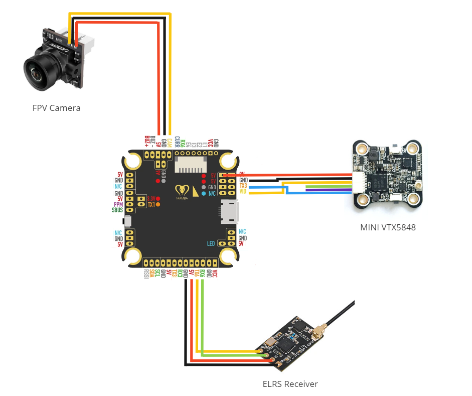
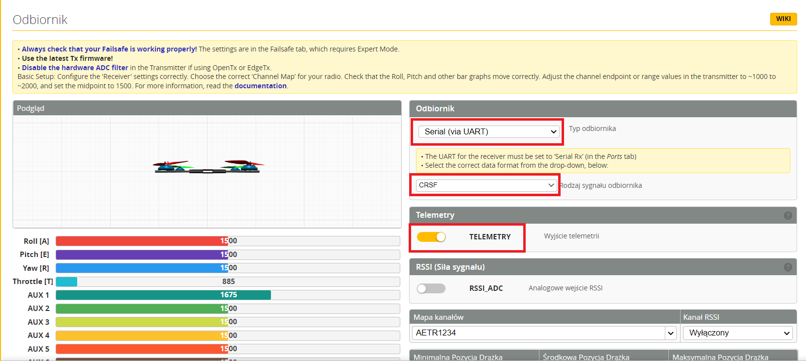
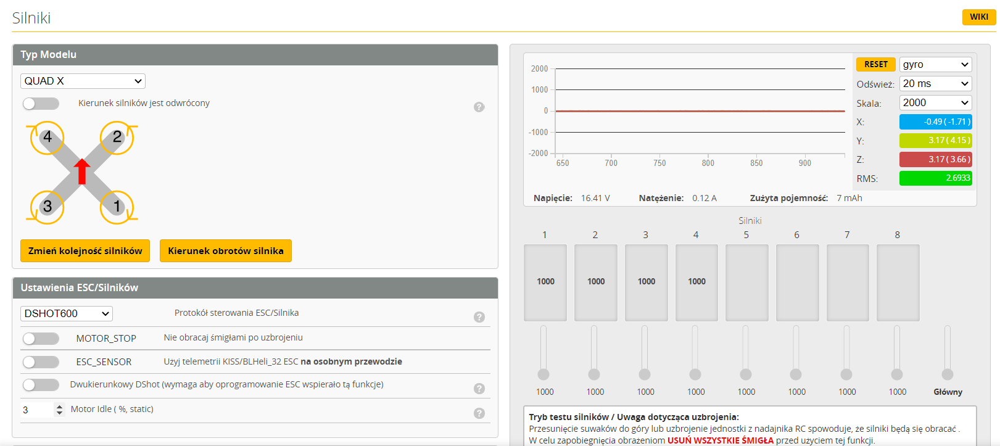
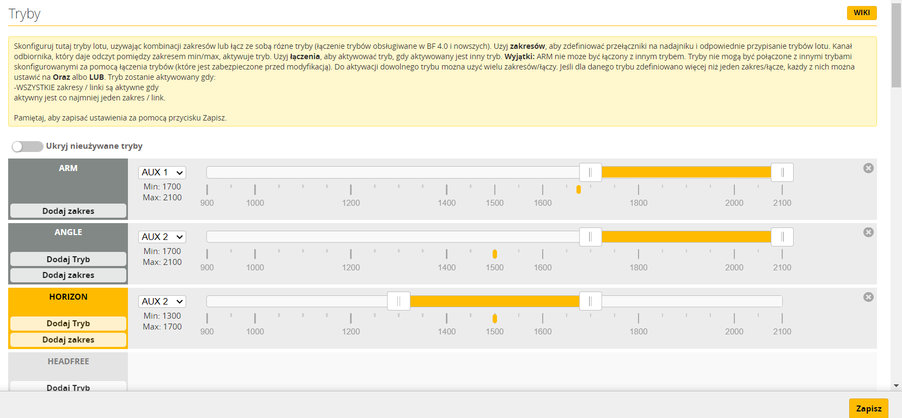
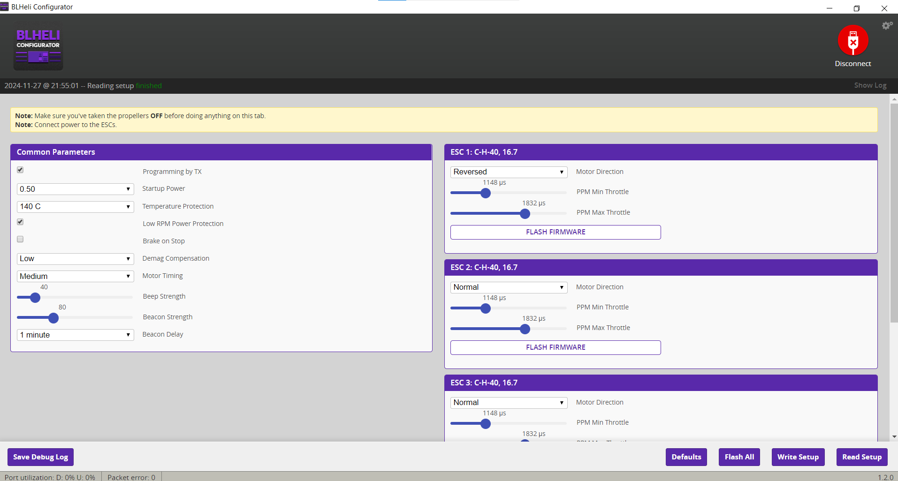

# Budget 5" FPV Drone

Below you can find all the necessary information that is required to build your first drone. The drone below was built 
from budget parts to start the adventure of FPV. It is not a perfect solution, but sufficient for learning.

## Parts
Parts prices are from 2023 (links may no longer be active)

| Drone parts                     | Links                                                                                                                                                                                                                                                                                                                                                                                                                                                                                                                                                                                                                      | Prices    |
|---------------------------------|----------------------------------------------------------------------------------------------------------------------------------------------------------------------------------------------------------------------------------------------------------------------------------------------------------------------------------------------------------------------------------------------------------------------------------------------------------------------------------------------------------------------------------------------------------------------------------------------------------------------------|-----------|
| Drone frame Martian IV 220mm 5" | [link](https://www.amazon.com/Martian-Thickness-Frame-Distribution-Racing/dp/B0BYKBBVBC/ref=sr_1_3?crid=HFIR5O7WO8Y5&dib=eyJ2IjoiMSJ9.YNrkLF8cruuiZzjSNcM73ncNLmG27VHd9ufCb4dyoFvFzrmNnq13n0sKOAQHMXQ4mt0D_bJ-9che7vCCU_pPDr7pBm-Ek0idYs1YsAlKCfo.-YL-KuVIcTHsW6plIxRAhWb6wczohwvyuB-zBUdVUtg&dib_tag=se&keywords=martian+iv+220mm&qid=1716200363&sprefix=martian+iv+220m%2Caps%2C184&sr=8-3)                                                                                                                                                                                                                              | 38 €      |
| Controller MAMBA F405MK2        | [link](https://www.banggood.com/pl/30_5+30_5mm-MAMBA-Stack-MK4-F722-APP-45A-6S-32bit-128K-Flytower-MPU6000-for-FPV-Racing-RC-Drone-p-1981925.html?rmmds=detail-topright-recommendation&cur_warehouse=CN&ID=6265504&trace_id=04021716200130585)                                                                                                                                                                                                                                                                                                                                                                             | 112 €     |
| Video transmiter MINI VTX5848   | [link](https://www.amazon.com/Switchable-Transmitter-Support-Configuration-Upgraded/dp/B07YWMTGT9/ref=sr_1_1?crid=35N2HBPBJXEJO&dib=eyJ2IjoiMSJ9.dOEjZt8TTawVGBF79y99P8GPvSmBb0Ey8njPb-K1maiTe3gBJHnF-aDSUuyV1j4p.uWB0ioiBf35FYmnsb8GOT6d9VYsXHkgnecclQbzeB3k&dib_tag=se&keywords=mini+vtx5848&qid=1716200452&sprefix=mini+vtx%2Caps%2C169&sr=8-1)                                                                                                                                                                                                                                                                         | 36 €      |
| FPV Camera                      | [link](https://www.amazon.com/Caddx-Lite-1200TVL-CMOS-NTSC/dp/B09P45J543/ref=sr_1_2?crid=2YI1FXOW86D6Z&dib=eyJ2IjoiMSJ9.lK60Ste0nzs5vtVK6DmyG0IwPe18S7JaSj5bKzJjIKjtvKXW6ZhjzsbGAZ4oohGBMh-_ntRMSsXbAXoDQjUcOaHRBoeMqRJZq5aP3_cNfk8OibVlC18SfZ2NW0CuOsdiGctuxug-EZ1mKMnNlmpkPKo22qWP2VmOj13UdP_SbXiJ1zcxGCIKUcr-8MsoDz8aNOLykBug3ftW1m4qUNmyUKUeHNAXBPPPmPHmYKI03II.xCox56A4b61E4CNZxU5rMReNCcZcTKfVvLBBMmHL-fc&dib_tag=se&keywords=Caddx+Ant+Analog+FPV+Camera&qid=1716200924&sprefix=mini+vtx5848%2Caps%2C571&sr=8-2)                                                                                                    | 18 €      |
| Propellers                      | [link](https://www.amazon.com/HQProp-Ethix-Candy-5-1x4x3-Propeller/dp/B099BQ7Q7S/ref=sr_1_2?dib=eyJ2IjoiMSJ9.gubnA5h1ta2938tCSQs4GriLr6pCOYMf9FzjH3NxJ9fGjHj071QN20LucGBJIEps.d76zcNwcF4JTlNgwdVerwtaKiGQWkfj1dQsxUe4lBrA&dib_tag=se&keywords=HQProp+Ethix+P4&qid=1716201687&sr=8-2)                                                                                                                                                                                                                                                                                                                                       | 4 €       |
| Engines BR2205                  | [link](https://www.banggood.com/pl/4X-Racerstar-Racing-Edition-2205-BR2205-2300KV-2-4S-Brushless-Motor-For-QAV250-ZMR250-RC-Drone-FPV-Racing-p-1066837.html?cur_warehouse=CN&rmmds=search)                                                                                                                                                                                                                                                                                                                                                                                                                                 | 63 €      |
| RHCP antena                     | [link](https://www.banggood.com/pl/FlyFishRC-Osprey-5_8Ghz-90mm-MMCX-FPV-Antenna-RHCP-for-RC-Drone-p-1987535.html?cur_warehouse=CN&ID=6309317&rmmds=search)                                                                                                                                                                                                                                                                                                                                                                                                                                                                | 9 €       |
| ELRS receiver                   | [link](https://www.amazon.com/RadioMaster-Receiver-ExpressLRS-Antenna-Transmitter/dp/B0BZY2M4BS/ref=sr_1_4?crid=273OZ3NQ3VW9&dib=eyJ2IjoiMSJ9.cOujNU95X3b1nq_fQcUy9IB8SQMuQqhvs28-E5ohzA6_-2Z8x2Z-wLxbYN6JT8zqo3u8lYXN1ntkwnJBOGe287ZbWB6DfsR6HfhMPGtTeY_6Y1HDlAzwzk9B9YcQjiSoGN58s7z3TsBF9WbMhGgj8FZsXlX6AKzZsDVQLvX--wFbcdXuPuiM9DyCWzFZLnix2G5nq2uCZKxIMtKTJxNqTaf5Sk5Z_EWNEUfT03IYMUkeTp3ufrCKSZVkSaQbcW32RIV9qKy1i5yFS89cHj_rKutb32ZLm7GionPVYkwQ5Vg.qxyY56Fb0VJD2OhkZCYdmU3eEaTlDK9986JMhv4gD-A&dib_tag=se&keywords=ELRS+NANORX+BETAFPV+2.4GHZ&qid=1716201375&sprefix=elrs+nanorx+betafpv+2.4ghz%2Caps%2C219&sr=8-4) | 16 €      |
| Batery CNHL 1500mAh 4s 100C     | [link](https://www.banggood.com/pl/CNHL-Black-Series-4S-14_8V-1500mAh-100C-LiPo-Battery-XT60-Plug-for-150-220mm-4-Inch-RC-Drone-FPV-Racing-p-1995303.html?cur_warehouse=CN&rmmds=search)                                                                                                                                                                                                                                                                                                                                                                                                                                   | 26 €      |
| **Summarize**                   |                                                                                                                                                                                                                                                                                                                                                                                                                                                                                                                                                                                                                            | **322 €** | 

| Accessories                   | Links                                                                                                                                                                                                                                                                                                                                                                                                                                                                                                                                                                                                                      | Prices    |
|-------------------------------|----------------------------------------------------------------------------------------------------------------------------------------------------------------------------------------------------------------------------------------------------------------------------------------------------------------------------------------------------------------------------------------------------------------------------------------------------------------------------------------------------------------------------------------------------------------------------------------------------------------------------|-----------|
| Batery charger                | [link](https://www.amazon.com/Riuty-Battery-Balance-Professional-Discharger/dp/B07T1XDNYD/ref=sr_1_3?crid=JM4NB09YAE37&dib=eyJ2IjoiMSJ9.6k3Mooup8HyhyRxchmNmFjy1-st0_xJQ7FJwtB4Pe3Y5W-w5Ng4WJShc80BcKpYGP3HHyap-o4P7tCny__G-gVbKO--5F6c66Mi9aUsiOrZx3qblJn4ZxkW7x1PduDVnryaUDtix72ITqPN7f_KCjPbHi4FUakgj0GtUou9nA3Z_U-K-57DAeWMVrt55M7VJ2YVncpjqrYlS64SKwjXp9cUsOYQit7zL6tRa_2lCUTj0LcR4_8UdZUq3eoWUFO9ZiBIC5ZEnHKBq7lvkXrtXZA5ItzTFw-E6FymFQRfWXec.VGlRFbXbIU0fhwJnF_5KMz1DSlu-igqby3_kl7ORBco&dib_tag=se&keywords=SkyRC+iMax+B6+V2&qid=1716201187&sprefix=skyrc+imax+b6+v2%2Caps%2C229&sr=8-3)                           | 31 €      |
| RadioMaster Pocket Controller | [link](https://www.banggood.com/pl/RadioMaster-Pocket-2_4GHz-16CH-ELRS-or-CC2500-Hall-Gimbals-EdgeTX-System-Radio-Controller-Built-in-LED-Lights-Transmitter-for-FPV-RC-Racer-Drone-p-1994795.html?utm_source=googleshopping&utm_medium=cpc_organic&gmcCountry=PL&utm_content=minha&utm_campaign=aceng-pmax-pl-pl-pc&currency=PLN&cur_warehouse=CN&createTmp=1&ID=629964262791556316246&utm_source=google&utm_medium=cpc_us&utm_content=suki2&utm_campaign=cceng-pla-caxx-rc-rcpart-SAsku-SKUK28862-20230821&ad_id=%7b%7bad.id%7d)                                                                                         | 75 €      |
| RadioMaster Pocket bateries   | [link](https://fpv.pl/pl/p/Komplet-baterii-18650-2500mAh-do-Radiomaster-TX12TX16SBOXER/183?gclid=CjwKCAiAs6-sBhBmEiwA1Nl8s_VUWXpJc-rZf_gaTRvcWWP0y1PBdhjWoC13plntK2n9jEmcOqfCixoCi3EQAvD_BwE)                                                                                                                                                                                                                                                                                                                                                                                                                              | 14 €      |
| FPV googles                   | [link](https://www.amazon.com/BETAFPV-Function-Replaceable-Recording-Compatible/dp/B0BKP7SHF9/ref=sr_1_2?crid=23KP4FIKRYPB0&dib=eyJ2IjoiMSJ9.AKoDCtenz2goPYt8RioOTNktDek8cfPiNbtvHYfETD5G13BRpTC5e2EddIQxtgDptzlmtpgMGd7P82-q-JnlXPL8zWYDGH-ypjJlVG4dTg6QXhlcFMk8EtvJQIyTF1Xsi13Mj6THYWEzmImTF8ccjUKPfyURZ9xGA9JamXSNYw5mctVTlio8W0_Eehra0i1XoLbwaPyizEIuB3XOIYkuFYLxeDgXOyBu9Phogpy_Mo4mZCIjDDVv_YhMdrgqGJ4NY0PBasko9pV6oSNNd9MYLfmaYklgrRb74Cz4sAVYXNY.SXMY_ozaQKw6TKpCN2NCOBKuPDHJXgDUZ_3S2oNv8OI&dib_tag=se&keywords=FPV+BETAFPV+VR03&qid=1716201440&sprefix=fpv+betafpv+vr03%2Caps%2C233&sr=8-2)                      | 89 €      |
| Sport camera (eg. LAMAX x7.2) |                                                                                                                                                                                                                                                                                                                                                                                                                                                                                                                                                                                                                            | 94 €      |
| **Summarize**                 |                                                                                                                                                                                                                                                                                                                                                                                                                                                                                                                                                                                                                            | **303 €** |

**Total price: 625 €**

## 3D parts
Below are links to the parts I designed:
- [VTX adapter](https://www.thingiverse.com/thing:6456251)
- [Drone bumpers](https://www.thingiverse.com/thing:6456247)
- [Drone stand](https://www.thingiverse.com/thing:6456239)

## Connection diagram
Below is the component connection diagram for FC. When it comes to connecting the motors to the ESC,
it does not matter in which order we solder the wires. Just remember the direction of rotation of the motors!

## Programming

### BetaFlight Configurator
[Download](https://github.com/betaflight/betaflight-configurator/releases)

Below you can find settings what you need to configure.

#### Ports

- UART3 - connection with VTX
- UART6 - connection with camera

#### Receiver

#### Engines

Make sure your model type is set to: QUAD X.

#### Modes

Basic modes to set.

### BLHeli Configurator
[Download](https://github.com/blheli-configurator/blheli-configurator/releases)

Make sure that ESC 1 and EST 4 are set to "Reversed". After change click on Write Setup button.

### Receiver connection
You can use this step by step instruction: 
[RadioMaster Pocket - How To Set Up and Bind a Drone - Step by Step](https://www.youtube.com/watch?v=GgaWMvAHZi8)

### Goggles connection

In the case of BetaFPV goggles, only what you need to do is long press "S" button. The goggles should find proper 
channel. Remember to power up the drone before binding.

## Tests
Run engines for the first time:

First flight attempt:

## First successful flight
Drone start:

A short video without editing from drone perspective:

## Drone simulators what I used:
- [Uncrashed: FPV Drone Simulator](https://store.steampowered.com/app/1682970/Uncrashed__FPV_Drone_Simulator/)
- 